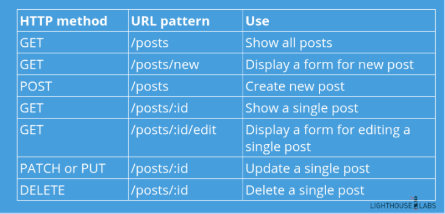

Where do we start?

# Planning
## 1. User Stories (20mins) ✅
  - https://medium.com/@jonatisokon/a-framework-for-user-stories-bc3dc323eca9

## 2. Features (15mins) ✅
  - Requirements analysis
  - MVP (minimum viable product)
  - Identify stretch goals
  - Discuss User Authentication requirements (Request clarification - Mentor Assistance)

## 3. Wireframes (30mins) ✅
  - VERY low-res version 
  - Figma

## 4. Data (30mins) ✅
  - Make all the ERDs (consider the data and relationships)
    - reference user stories here
  - Draw.io

## 5. Routes (30mins)
  
  - RESTful
  - create table outlining: http method, url pattern, use

## 6. Stack Choices (10mins) ✅
  - e.g. use SASS or not? etc.
  - SPA vs MPA

## 7. Determine the tasks (20mins+)
  - separate out the different feature branches and add them to Trello

## 8. Dividing Tasks (15mins)
  - decide how tasks will be divided (Vertical vs Horizontal)
  - set meeting times
  - decide on collaboration tools (slack, discord, trello, etc.)

  SCHEDULE
  10AM - 12:45pm Finish Planning Phase
