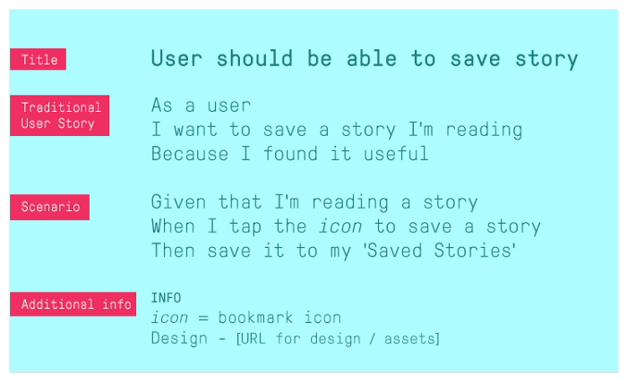

# User Stories

## User should be able to create a quiz

> As a user  
I want to create a quiz   
Because I want to share a quiz
  
> Given that I have questions and answers  
When I tap the icon to create a quiz  
Then allow me to input my questions and answers and retrieve a quiz link

## User should be able to make quiz unlisted

> As a user  
I want to not show my quiz publicly  
Because I am private
  
> Given that I created a quiz   
When I tap the icon to make quiz private
Then quiz shouldn't be publicly accessible without a direct link

## User should be able to share a link to a single quiz

> As a user  
I want to share a quiz  
Because I want to test friends' knowledge

> Given that I created a quiz
When I share a link with other people
Then they should be able to attempt my quiz

## User should be able to see list of public quizes

> As a user 
I want to see all public quizes 
Because I want to test my knowledge

Given that I want to attempt a public quiz
When I am on the homepage
Then I should be able to view a list of public quizes to attempt

## User should be able to attempt a quiz
> As a user  
I want to attempt a quiz  
Because I want to test my knowledge

> Given that I have a link to a quiz
When I navigate to it
Then its associated quiz should be availble for me to attempt

## User should be able to see results of recent attempts
> As a user  
I want to see the scores of my recent quiz attempts  
Because I want to know how well I did

> Given that I've completed a quiz  
When I am on scores page  
Then my recent scores are shown  

## User should be able to share a link to their results of an attempt

> As a user  
I want to share the score of my quiz attempt   
Because I want other people to know  

> Given that I completed a quiz  
When I tap icon to share score  
Then I receive a link to share my quiz results  

